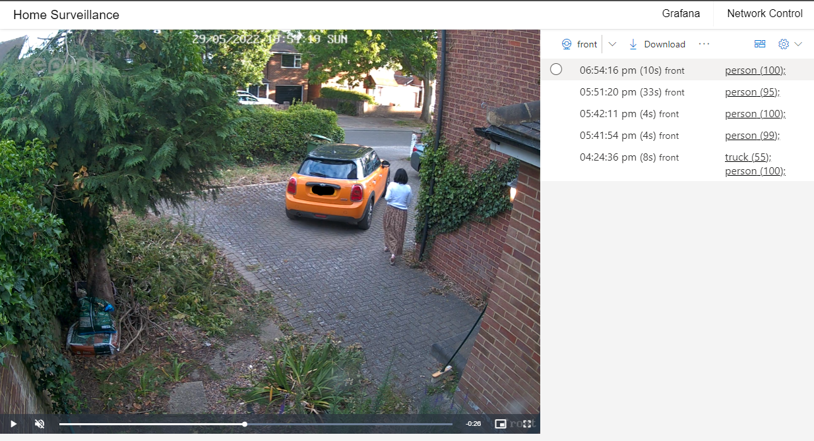
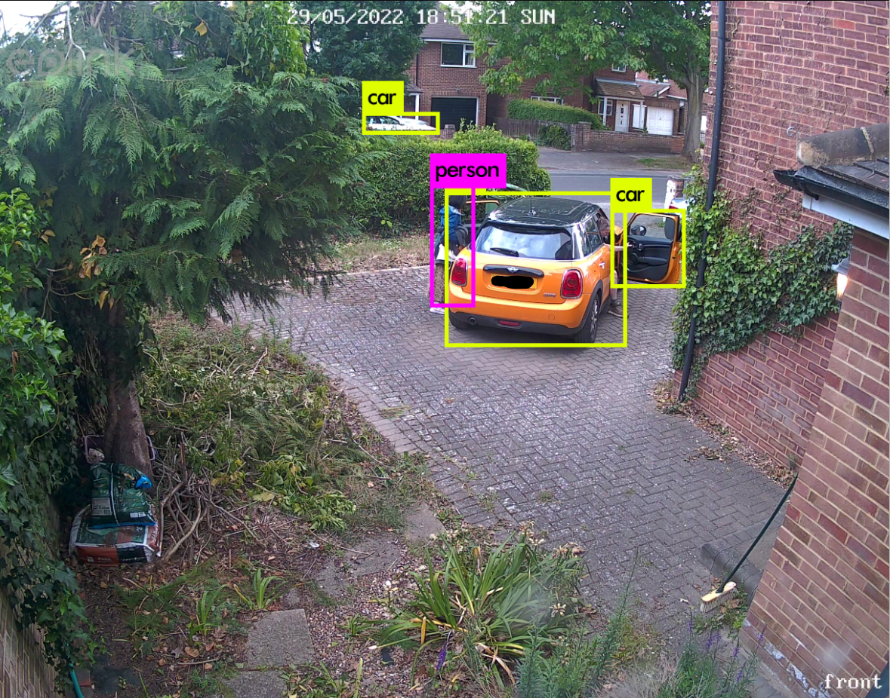
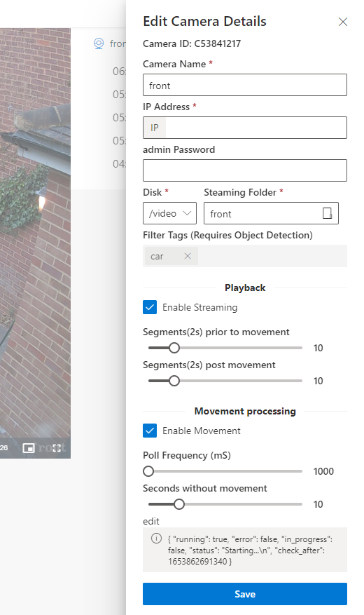

#  Open-Source Network Video Recorder (NVR), with Object Detection

Web application to monitor your IP Security Camera network, continously record camera feeds to your computers harddrive, and monitor motion events through a web app. Features include:

  :heavy_check_mark:  No expensive specialised hardware required, use your old computers & harddrives
  :heavy_check_mark:  No cloud account required, self-contained
  :heavy_check_mark:  Enhance your Cameras motion detection with Object Detection tagging, reducing false positives
  :heavy_check_mark:  Supports mutliple camreas
  :heavy_check_mark:  Ensure you hardisk never runs out of space, automatically deleting the oldest video segements when needed 



In addition, if your cameras motion senssor triggers a detection, the app will take a still of the detection, and run a Object Detection process, to tag the still with the objects in the picture.  You can then use these tags to filter and review your motion events.  This is very useful to avoid false positives, like the sun going behind a cloud, or a rain shower.



This repo was developed with Reolink POE cameras, that provided a RTMP endpoint, and a API for motion detection. But can be develoed/extended for other IP cameras

  

## Install / Setup / Run

The benifit of this app, its, its open-source, and it can be installed on any comodity h/w running linux (a free o/s operating system), techincal savvy users should be able to get this working.


### Build & Run Web App

Ensure you have `nodejs` (recommended version >= 16 LTS) and `ffmpeg` (latest version) installed.

Clone this repo onto a Linux machine, then build the app by running these commands: 


```
# install dependencies
npm i

# build typescript server
npm run-script buildserver

# build fromend
npm run-script build
```

### To manually run the server

```
node ./lib/index.js
```

Then open a browser and navigate to http://<hostname>:8080


## Darknet Real-time object detection

To enable the Object Detection feature, you will  need to install the following darknet/yolo project, information here: https://pjreddie.com/darknet/yolo/.  Then, go into the settings panel, enable object detection, and set the installation folder


## To run the server each time the machine starts

Create a executable `web.sh` file containing the following (the paths need to be absolute):

```
WEBPATH="/home/<user>/open-source-nvr/build" DBPATH="/home/<user>/open-source-nvr/mydb" node /home/<user>/open-source-nvr/lib/index.js
```

Now, create a `camera_web.service` file for Linux Systemd service managers, to ensure your website starts when the machine starts & will be kept running

```
[Unit]
Description=camera1_web
Wants=network-online.target
After=network-online.target

[Service]
User=<user>
Group=<user>
Type=simple
ExecStart=/home/<user>/open-source-nvr/web.sh

[Install]
WantedBy=multi-user.target
```

Copy the `camera_web.service` file to `/etc/systemd/system` , and replacing the `<user>`

Enable & run the service

```
sudo systemctl enable  camera_web.service
sudo systemctl start  camera_web.service
```


## Additional Systemd commands

### list services
```
systemctl --type=service
```
### list logs
```
sudo journalctl -u camera_web.service -f
sudo journalctl -u camera_web.service -n 100 --no-pager
```


## Example to create Logic Volume for the local files 

To create a logical volume from a volume group storage pool, use the ```lvcreate``` command. Specify the size of the logical volume with the -L option, specify a name with the -n option, and pass in the volume group to allocate the space from.

```
sudo lvcreate -L 40G -n video-files ubuntu-vg
```

format:
```
sudo mkfs -t ext4 /dev/mapper/ubuntu--vg-video--files
```

mount:

```
mkdir /video
sudo mount /dev/mapper/ubuntu--vg-video--files  /video
```

ensure its always mounted:
```
sudo vi /etc/fstab
/dev/mapper/ubuntu--vg-video--files /video ext4 defaults 0 0
```


## Video Format Info

The video encapsulation format used by all Reolink cameras is MP4. So the video's format we download via Reolink Client or Reolink app is MP4. But when using USB disk to backup videos directly from Reolink NVR, you could choose either H.264 or MP4 video files. - the compression type is H264


## The player

https://videojs.com/


HTTP Live Streaming (HLS) is a widely used protocol developed by Apple that will serve your stream better to a multitude of devices. HLS will take your stream, break it into chunks, and serve it via a specialized playlist


